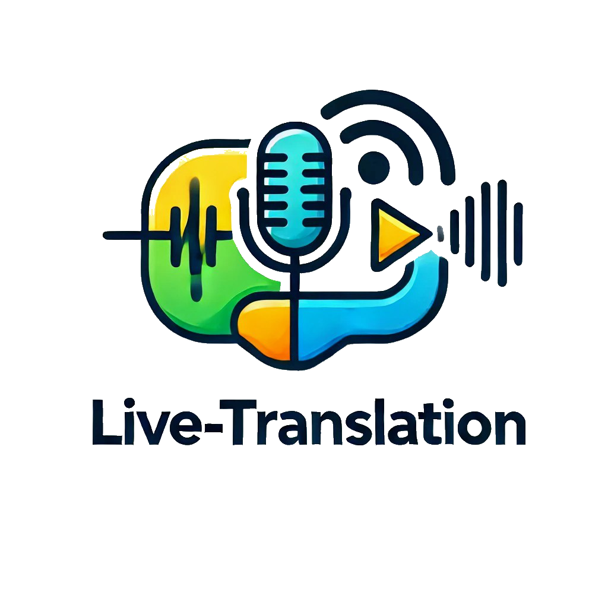
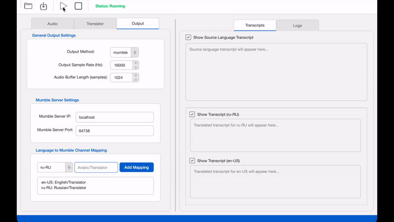
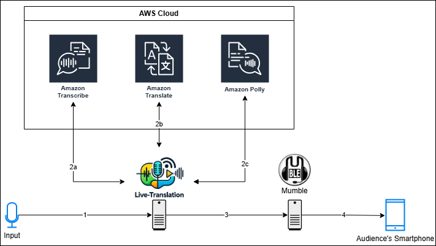

<div align="center">

<p align="center">
  
</p>

<p>
Real-time speech translation service with multi-language audio output.
</p>

<p>
Live audio is transcribed, translated, converted back to speech, and streamed to separate Mumble channels — enabling multilingual audiences to listen in their preferred language.
</p>

<p>
  <a href="https://github.com/RaHummel/live-translation/issues">
    
  </a>
  <a href="https://github.com/RaHummel/live-translation/stargazers">
    
  </a>
  <a href="https://github.com/RaHummel/live-translation/network/members">
    
  </a>
  <a href="https://github.com/RaHummel/live-translation/blob/main/LICENSE">
    
  </a>
</p>

</div>

---

## 🎬 Demo

<p align="center">
  
</p>

---

## ✨ Features

- 🎙 **Real-time Speech Translation**
- 🌍 **Multiple Target Languages in Parallel**
- 🔊 **Audio Output via Speaker or Mumble**
- 🎛 **Configurable Language-to-Channel Mapping**
- 🔄 **Modular Translator Architecture (AWS supported)**
- 🖥 **GUI + CLI Mode**

---

## 🚀 Use Cases

- ⛪ Church services with international audience  
- 🌍 Multilingual conferences  
- 🎓 University lectures  
- 🏢 Corporate town halls   

---

## 🏗 Architecture Overview

The following diagram illustrates the recommended setup:

<p align="center">
  
</p>

### Processing Pipeline

1. **Audio Input**  
   Audio is captured from a microphone or audio mixer and streamed into the translation service.

2. **Speech Processing (AWS)**  
   - **Speech-to-Text:** AWS Transcribe converts audio into text  
   - **Text-to-Text:** AWS Translate translates into target languages  
   - **Text-to-Speech:** AWS Polly generates spoken audio per language  

3. **Audio Distribution**  
   Each language connects to a dedicated Mumble channel.

4. **Audience Access**  
   Listeners join their preferred language channel using:
   - iOS: [Mumble](https://apps.apple.com/de/app/mumble/id443472808)  
   - Android: [Mumla](https://play.google.com/store/apps/details?id=se.lublin.mumla&hl=de)

---

## ⚡ Quick Start (Development)

```bash
git clone https://github.com/RaHummel/live-translation.git
cd live-translation
make install
python src/main.py
```

The application will automatically create its configuration file on first start.  
Settings can be adjusted and saved via the GUI.

---

## 📦 Installation

Prebuilt installers are available on the  
👉 [Releases Page](https://github.com/RaHummel/live-translation/releases)

### Prerequisites

- **Python 3.14**
- **PortAudio**
- **Opus**
- **uv package manager**

### macOS

```bash
brew install portaudio
brew install opus
brew install uv
```

If required:

```bash
sudo mkdir -p /usr/local/lib
sudo cp $(brew --prefix opus)/lib/libopus.* /usr/local/lib/
```

### Windows

- Install PortAudio via `vcpkg`
- Install Opus via `vcpkg`
- Install `uv`
- Optional: Install NSIS to build `.exe` installer

See troubleshooting:  
`docs/BuildTroubleshooting.md`

---

## 🛠 Building Standalone Installers

### macOS (.dmg)

```bash
./build-installer.sh
```

Output:
```
dist/installers/LiveTranslation-<version>-macOS.dmg
```

### Windows (.exe)

```powershell
.\build-installer.ps1
```

Output:
```
dist/installers/LiveTranslation-<version>-setup.exe
```

Without NSIS, a portable bundle will be created in:

```
dist/live-translation/
```

---

## 🖥 Usage

### GUI Mode (Default)

Launch the installed application normally.

### CLI Mode

**Arguments:**

- `--no-gui` → Run without graphical interface  
- `-sl, --source_lang` → Source language (e.g. `de-DE`)  
- `-tl, --target_lang` → Target languages (e.g. `en-US ru-RU`)  
- `-v, --verbose` → Enable verbose logging  

**macOS Example:**

```bash
/Applications/live-translation.app/Contents/MacOS/live-translation --no-gui -sl de-DE -tl en-US
```

**Windows Example:**

```powershell
"C:\Program Files\Live Translation\live-translation.exe" --no-gui -sl de-DE -tl en-US
```

---

## 🌍 Translators

Currently supported:

- **AWS (Transcribe, Translate, Polly)**

Setup instructions:  
👉 `docs/AwsSetup.md`

Supported voices and languages:  
https://docs.aws.amazon.com/polly/latest/dg/available-voices.html

---

## 🎧 Mumble Setup

Detailed instructions:  
👉 `docs/MumbleSetup.md`

---

## 💰 Cost Notice

This project uses AWS Transcribe, Translate and Polly.  
Using the service will incur AWS costs depending on usage.

Please review AWS pricing before deploying in production.

---

## 🧪 Development

Activate environment:

```bash
uv sync
source .venv/bin/activate  # macOS/Linux
.\.venv\Scripts\activate   # Windows
python src/main.py # Run
```

Or:

```bash
uv run python src/main.py
```

---

## 🔄 Protobuf Regeneration

If `Mumble.proto` changes:

```bash
make proto
```

---

## 🛣 Roadmap

- [ ] Support additional translation providers (e.g. OpenAI, Google Gemini, Local models...)
- [ ] Support additional Outputs (Web, Discord, etc.) 
- [ ] Provdide automatic Mumble Server setup
- [ ] Latency and performance optimizations

---

## ⚠ Known Issues

- `opuslib` and `pymumble` are no longer actively maintained  
  → Forked versions are used with required modifications

---

## 🤝 Contributing

Contributions are welcome!

1. Fork the repository  
2. Create a feature branch  
3. Submit a pull request  

---

## 📜 License

See [LICENSE](LICENSE)

---
